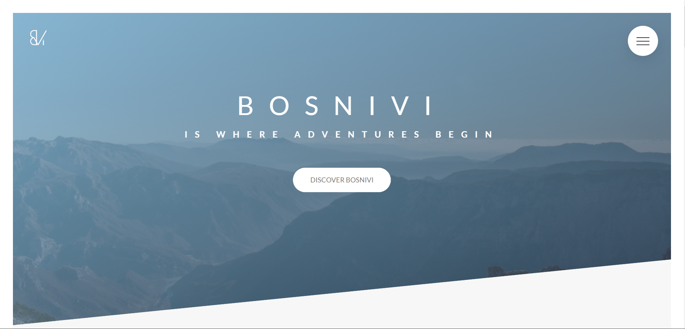
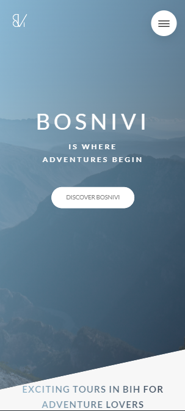

# Bosnivi: Bosnian Tourist Agency Website

[Live Demo](https://bosnivi.netlify.app/)

## Project Description
Bosnivi is a prototype website designed for a Bosnian tourist agency. The project aims to promote tourism by providing detailed information about travel destinations, cultural experiences, and activities in Bosnia and Herzegovina. This website serves as a foundation for further development into a fully operational platform for travel enthusiasts.

---

## Features
- **Localized Content**: Tailored to showcase the beauty and culture of Bosnia and Herzegovina.
- **Responsive Design**: Optimized for seamless browsing across devices.
- **Tour Packages**: Highlights travel packages and services.

---

## Technologies Used
- **HTML5**: For structuring the website.
- **CSS3**: For styling and layout.
- **JavaScript**: For interactive elements and dynamic features.

---

## Setup Instructions
To run this project locally, follow these steps:

1. Clone the repository:

   ```bash
   git clone https://github.com/AndNijaz/Bosnivi.git
   ```

2. Navigate to the project directory:

   ```bash
   cd Bosnivi
   ```

3. Open `index.html` in your preferred browser.

---

## Usage
The website is intended for:
- Showcasing tourist destinations and cultural highlights in Bosnia and Herzegovina.
- Providing information about travel packages and services.
- Attracting potential tourists and stakeholders for feedback and collaboration.

---

## Screenshots

### Desktop View


### Mobile View


> *Screenshots are stored in the `/img` directory.*

---

## Project Status
This project is currently a **prototype**. Future development plans include:
- Adding a booking system for travel packages.
- Integrating user profiles and feedback sections.
- Expanding content with more destinations and travel tips.

---

## Acknowledgements
This project was initiated to support tourism in Bosnia and Herzegovina. It reflects the beauty and cultural richness of the region and aims to attract travelers from around the world.

---

## Live Demo
Check out the live version here: [Bosnivi Website](https://bosnivi.netlify.app/)
